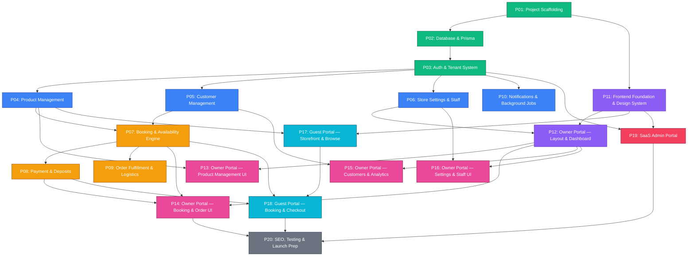

# Development Execution Plan — ClosetRent SaaS

## How This Plan Works

This project is built by **AI agent teams**. Each work package below is a **self-contained mission** — an agent reads the package file, builds everything described in it, tests it, and delivers a working module.

### Rules
1. **Never split a module** — each package contains the full vertical slice (schema → API → service → tests)
2. **Dependencies are strict** — a package cannot start until all its `REQUIRES` packages are complete
3. **Parallel when possible** — packages at the same phase level can run simultaneously
4. **Full context per package** — each package file lists every doc the agent must read

---

## Dependency Graph



---

## Phase Map

### 🟩 Phase 1 — Foundation (Sequential, No Parallelism)

| Package | Name | Est. Time | Dependencies |
|---|---|---|---|
| **P01** | Project Scaffolding & DevOps | 3–4 hours | None |
| **P02** | Database Schema & Prisma | 2–3 hours | P01 |
| **P03** | Auth & Tenant System | 4–5 hours | P02 |

---

### 🟦 Phase 2 — Core Business Modules (3 Agents in Parallel)

| Package | Name | Est. Time | Dependencies |
|---|---|---|---|
| **P04** | Product Management (Backend) | 5–6 hours | P03 |
| **P05** | Customer Management (Backend) | 2–3 hours | P03 |
| **P06** | Store Settings & Staff (Backend) | 3–4 hours | P03 |
| **P10** | Notifications & Background Jobs | 3–4 hours | P03 |

> 🔀 **P04, P05, P06, P10 can all run in parallel** — they share no data dependencies

---

### 🟨 Phase 3 — Transaction Engine (Sequential after Phase 2)

| Package | Name | Est. Time | Dependencies |
|---|---|---|---|
| **P07** | Booking & Availability Engine | 5–6 hours | P04 + P05 |
| **P08** | Payment & Deposit System | 3–4 hours | P07 |
| **P09** | Order Fulfillment & Logistics | 3–4 hours | P07 |

> 🔀 **P08 and P09 can run in parallel** after P07

---

### 🟪 Phase 4 — Frontend Foundation (Can Start After P01)

| Package | Name | Est. Time | Dependencies |
|---|---|---|---|
| **P11** | Frontend Scaffolding & Design System | 4–5 hours | P01 |

> ⚡ **P11 can start in parallel with Phase 1's P02 and P03** — it only needs the monorepo from P01

---

### 🩷 Phase 5 — Owner Portal Frontend (After P11 + Backend APIs)

| Package | Name | Est. Time | Dependencies |
|---|---|---|---|
| **P12** | Owner Portal — Layout & Dashboard | 3–4 hours | P11 + P06 |
| **P13** | Owner Portal — Product Management UI | 4–5 hours | P12 + P04 |
| **P14** | Owner Portal — Booking & Order Management UI | 4–5 hours | P12 + P07 + P08 |
| **P15** | Owner Portal — Customers & Analytics UI | 3–4 hours | P12 + P05 |
| **P16** | Owner Portal — Settings & Staff UI | 3–4 hours | P12 + P06 |

> 🔀 **P13, P14, P15, P16 can all run in parallel** after P12 is done

---

### 🩵 Phase 6 — Guest Portal Frontend (After P11 + Backend APIs)

| Package | Name | Est. Time | Dependencies |
|---|---|---|---|
| **P17** | Guest Portal — Storefront & Browse | 4–5 hours | P11 + P04 |
| **P18** | Guest Portal — Booking & Checkout | 4–5 hours | P17 + P07 + P08 |

---

### 🔴 Phase 7 — Admin Portal (After P11 + P03)

| Package | Name | Est. Time | Dependencies |
|---|---|---|---|
| **P19** | SaaS Admin Portal (Full Stack) | 4–5 hours | P11 + P03 |

> 🔀 **P19 can run in parallel with Phase 5 and 6**

---

### ⬜ Phase 8 — Polish & Launch (After Everything)

| Package | Name | Est. Time | Dependencies |
|---|---|---|---|
| **P20** | SEO, Testing & Launch Prep | 4–5 hours | P18 + P14 + P19 |

---

## Parallelism Visualization (Timeline)

```
Week 1:  ████ P01 → ████ P02 → ████████ P03
         ░░░░░░░░░░░░░░░░░░░░ ████████ P11 (frontend, parallel)

Week 2:  ████████ P04 ═══╗
         ████ P05 ════════╬══ (parallel agents)
         ██████ P06 ══════╣
         ██████ P10 ══════╝

Week 3:  ████████████ P07 → ██████ P08
                            ██████ P09 (parallel with P08)
         ████████ P12 (needs P06+P11)

Week 4:  ████████ P13 ═══╗
         ████████ P14 ════╬══ (parallel agents)
         ██████ P15 ══════╣
         ██████ P16 ══════╝
         ████████ P17 ════╝ (parallel with owner portal)
         ████████ P19 ════╝ (parallel admin portal)

Week 5:  ████████ P18
         ████████ P20 (SEO, tests, launch)
```

**Critical Path**: P01 → P02 → P03 → P04 → P07 → P08 → P14/P18 → P20
**Estimated Total**: ~5 weeks with 2–4 parallel agents

---

## Package File Index

Each package file lives in `docs/development/` and follows this structure:

```markdown
# Package Title
## REQUIRES (input dependencies)
## AGENT SKILLS (which .agents/skills/ to read before starting)
## SCOPE (what to build)
## REFERENCE DOCS (which /docs/ files to read)
## DELIVERABLES (what the agent must produce)  
## ACCEPTANCE CRITERIA (how to verify it works)
## OUTPUT CONTRACTS (what other packages depend on from this)
```

| File | Package | Status |
|---|---|---|
| [P01-project-scaffolding.md](./P01-project-scaffolding.md) | Project Scaffolding & DevOps | ✅ |
| [P02-database-schema.md](./P02-database-schema.md) | Database Schema & Prisma | ✅ |
| [P03-auth-tenant.md](./P03-auth-tenant.md) | Auth & Tenant System | ✅ |
| [P04-product-management.md](./P04-product-management.md) | Product Management (Backend) | ✅ |
| [P05-customer-management.md](./P05-customer-management.md) | Customer Management (Backend) | ✅ |
| [P06-store-settings-staff.md](./P06-store-settings-staff.md) | Store Settings & Staff Management | ✅ |
| [P07-booking-engine.md](./P07-booking-engine.md) | Booking & Availability Engine | ⬜ |
| [P08-payment-deposits.md](./P08-payment-deposits.md) | Payment & Deposit System | ⬜ |
| [P09-order-fulfillment.md](./P09-order-fulfillment.md) | Order Fulfillment & Logistics | ⬜ |
| [P10-notifications-jobs.md](./P10-notifications-jobs.md) | Notifications & Background Jobs | ⬜ |
| [P11-frontend-foundation.md](./P11-frontend-foundation.md) | Frontend Scaffolding & Design System | ⬜ |
| [P12-owner-layout-dashboard.md](./P12-owner-layout-dashboard.md) | Owner Portal — Layout & Dashboard | ⬜ |
| [P13-owner-products-ui.md](./P13-owner-products-ui.md) | Owner Portal — Product Management UI | ⬜ |
| [P14-owner-bookings-ui.md](./P14-owner-bookings-ui.md) | Owner Portal — Booking & Order UI | ⬜ |
| [P15-owner-customers-analytics.md](./P15-owner-customers-analytics.md) | Owner Portal — Customers & Analytics | ⬜ |
| [P16-owner-settings-ui.md](./P16-owner-settings-ui.md) | Owner Portal — Settings & Staff UI | ⬜ |
| [P17-guest-storefront.md](./P17-guest-storefront.md) | Guest Portal — Storefront & Browse | ⬜ |
| [P18-guest-checkout.md](./P18-guest-checkout.md) | Guest Portal — Booking & Checkout | ⬜ |
| [P19-admin-portal.md](./P19-admin-portal.md) | SaaS Admin Portal | ⬜ |
| [P20-seo-testing-launch.md](./P20-seo-testing-launch.md) | SEO, Testing & Launch Prep | ⬜ |

---

## Doc-to-Package Mapping

Every existing documentation file is assigned to exactly one package:

### Database Schemas (`docs/database/`)
| Doc | Assigned To |
|---|---|
| `_overview.md` | P02 |
| `tenant.md`, `user.md`, `subscription.md` | P02 + P03 |
| `product.md`, `product-variant.md`, `product-image.md`, `product-detail.md` | P04 |
| `category.md`, `event.md`, `color.md` | P04 |
| `pricing.md`, `service-options.md`, `size.md` | P04 |
| `customer.md` | P05 |
| `booking.md`, `booking-item.md` | P07 |
| `payment.md` | P08 |
| `notification.md`, `audit-log.md` | P10 |
| `faq.md`, `review.md` | P04 |
| `seed-data.md` | P02 |

### Feature Specs (`docs/features/`)
| Doc | Assigned To |
|---|---|
| `multi-tenant.md`, `session-management.md`, `staff-access.md` | P03 |
| `category-management.md`, `color-variant-system.md`, `product-details-builder.md` | P04 |
| `rental-pricing.md`, `size-system.md`, `service-protection.md` | P04 |
| `stock-inventory.md`, `target-tracking.md`, `try-before-rent.md` | P04 |
| `search-system.md`, `filter-system.md`, `faq-system.md` | P04 |
| `customer-management.md` | P05 |
| `business-branding.md`, `custom-domain.md`, `localization.md` | P06 |
| `availability-engine.md`, `booking-system.md`, `cart-system.md` | P07 |
| `checkout-flow.md`, `timing-logistics.md` | P07 |
| `payment-integration.md`, `deposit-refund.md`, `damage-loss-handling.md` | P08 |
| `order-management.md`, `courier-integration.md` | P09 |
| `notification-system.md` | P10 |
| `analytics-dashboard.md` | P15 |
| `saas-admin-portal.md` | P19 |

### API Specs (`docs/api/`)
| Doc | Assigned To |
|---|---|
| `_overview.md`, `auth.md`, `tenant.md` | P03 |
| `product.md`, `category.md`, `search.md`, `inventory.md`, `upload.md` | P04 |
| `customer.md` | P05 |
| `booking.md`, `order.md` | P07 |
| `payment.md` | P08 |
| `notification.md` | P10 |
| `analytics.md` | P15 |
| `admin.md` | P19 |

### UI Specs (`docs/ui/`)
| Doc | Assigned To |
|---|---|
| `owner/dashboard.md` | P12 |
| `owner/add-product.md`, `owner/edit-product.md`, `owner/product-list.md` | P13 |
| `owner/booking-management.md`, `owner/order-management.md` | P14 |
| `owner/customer-list.md`, `owner/analytics.md` | P15 |
| `owner/store-settings.md`, `owner/staff-management.md` | P16 |
| `guest/storefront-layout.md`, `guest/shopping-page.md`, `guest/product-details.md` | P17 |
| `guest/cart-page.md`, `guest/checkout-page.md`, `guest/booking-confirmation.md` | P18 |

### Flow Docs (`docs/flows/`)
| Doc | Assigned To |
|---|---|
| `tenant-onboarding-flow.md` | P03 |
| `owner-add-product-flow.md` | P04/P13 |
| `guest-booking-flow.md` | P07/P18 |
| `payment-flow.md` | P08 |
| `owner-fulfill-order-flow.md` | P09/P14 |
| `deposit-refund-flow.md` | P08/P14 |
| `damage-claim-flow.md` | P08/P14 |
| `late-return-flow.md` | P07/P14 |

### Cross-Cutting Docs (Read by ALL agents)
| Doc | Why |
|---|---|
| `architecture.md` | System architecture understanding |
| `architecture-decisions.md` | 28 ADRs — every agent must follow |
| `coding-standards.md` | Code style, naming, patterns |
| `tech-stack.md` | Technology choices |
| `environment-variables.md` | Configuration reference |
| `glossary.md` | Consistent terminology |
| `performance-engineering.md` | Performance patterns |
| `scalability-engineering.md` | Scalability patterns |
| `deletion-strategy.md` | Soft delete rules |
| `event-system.md` | Event-driven patterns |
| `localization-strategy.md` | Locale handling |
| `frontend-architecture.md` | Frontend patterns |

---

## Agent Skills Reference

> **MANDATORY**: Before starting any work package, agents **MUST** read the SKILL.md files listed for that package. Skills are located in `.agents/skills/<skill-name>/SKILL.md`.

### Installed Skills (16 total)

| Skill | Description | Applies To |
|---|---|---|
| `brainstorming` | Explore requirements before building | **All packages** — use before any creative work |
| `nestjs-best-practices` | Architecture, DI, security, error handling patterns | P03–P10, P19 (all backend) |
| `nestjs-expert` | Deep NestJS troubleshooting and patterns | P03–P10, P19 (all backend) |
| `typescript-expert` | Type-level programming, strict mode, monorepo | **All packages** |
| `nodejs-best-practices` | Framework selection, async patterns, security | P03–P10, P19 (all backend) |
| `postgresql-best-practices` | Schema design, query optimization, indexing | P02, P07, P08, P09 |
| `postgresql-database-engineering` | Advanced PG features, MVCC, replication | P02, P20 |
| `postgresql-table-design` | Table design patterns, constraints, data types | P02 |
| `prisma-database-setup` | Prisma configuration and client setup | P02, P03 |
| `prisma-postgres` | Prisma Postgres provisioning and management | P02 |
| `redis-best-practices` | Caching, sessions, data structures | P10, P07 |
| `redis-development` | Redis Query Engine, performance optimization | P10 |
| `nextjs-best-practices` | App Router, Server Components, data fetching | P11–P20 (all frontend) |
| `nextjs-app-router-patterns` | Streaming, parallel routes, advanced SSR | P11–P20 (all frontend) |
| `vercel-react-best-practices` | React performance, bundle optimization | P11–P20 (all frontend) |
| `minio` | S3-compatible object storage API | P10 (file uploads) |

### Per-Package Skill Matrix

| Package | Required Skills | Optional Skills |
|---|---|---|
| **P01** | `typescript-expert` | — |
| **P02** | `postgresql-best-practices`, `postgresql-table-design`, `prisma-database-setup` | `postgresql-database-engineering`, `prisma-postgres` |
| **P03** | `nestjs-best-practices`, `nestjs-expert`, `nodejs-best-practices` | `prisma-database-setup` |
| **P04** | `nestjs-best-practices`, `nestjs-expert`, `typescript-expert` | `postgresql-best-practices` |
| **P05** | `nestjs-best-practices`, `nestjs-expert` | — |
| **P06** | `nestjs-best-practices`, `nestjs-expert`, `typescript-expert` | — |
| **P07** | `nestjs-best-practices`, `nestjs-expert`, `postgresql-best-practices` | `redis-best-practices` |
| **P08** | `nestjs-best-practices`, `nestjs-expert`, `postgresql-best-practices` | — |
| **P09** | `nestjs-best-practices`, `nestjs-expert` | — |
| **P10** | `nestjs-best-practices`, `redis-best-practices`, `redis-development` | `minio` |
| **P11** | `nextjs-best-practices`, `nextjs-app-router-patterns`, `vercel-react-best-practices` | `typescript-expert` |
| **P12** | `nextjs-best-practices`, `nextjs-app-router-patterns`, `vercel-react-best-practices` | — |
| **P13** | `nextjs-best-practices`, `vercel-react-best-practices` | — |
| **P14** | `nextjs-best-practices`, `vercel-react-best-practices` | — |
| **P15** | `nextjs-best-practices`, `vercel-react-best-practices` | — |
| **P16** | `nextjs-best-practices`, `vercel-react-best-practices` | — |
| **P17** | `nextjs-best-practices`, `nextjs-app-router-patterns`, `vercel-react-best-practices` | — |
| **P18** | `nextjs-best-practices`, `nextjs-app-router-patterns`, `vercel-react-best-practices` | — |
| **P19** | `nestjs-best-practices`, `nextjs-best-practices`, `vercel-react-best-practices` | `typescript-expert` |
| **P20** | `nextjs-best-practices`, `vercel-react-best-practices` | `postgresql-database-engineering` |

### Skill Usage Rules

1. **Always read SKILL.md first** — each skill file contains when-to-apply triggers and priority rules
2. **`brainstorming` is mandatory** before any creative/architectural work — it explores intent and requirements before implementation
3. **Backend packages** (P03–P10, P19) must always reference `nestjs-best-practices` — it contains 40 rules across 10 categories
4. **Frontend packages** (P11–P20) must always reference `nextjs-best-practices` and `vercel-react-best-practices`
5. **Database-heavy packages** (P02, P07, P08) must reference `postgresql-best-practices` for query optimization
6. **Some skills have detailed rule files** — `nestjs-best-practices` has an `AGENTS.md` with 5,900+ lines of detailed rules. Read the sections relevant to your package

