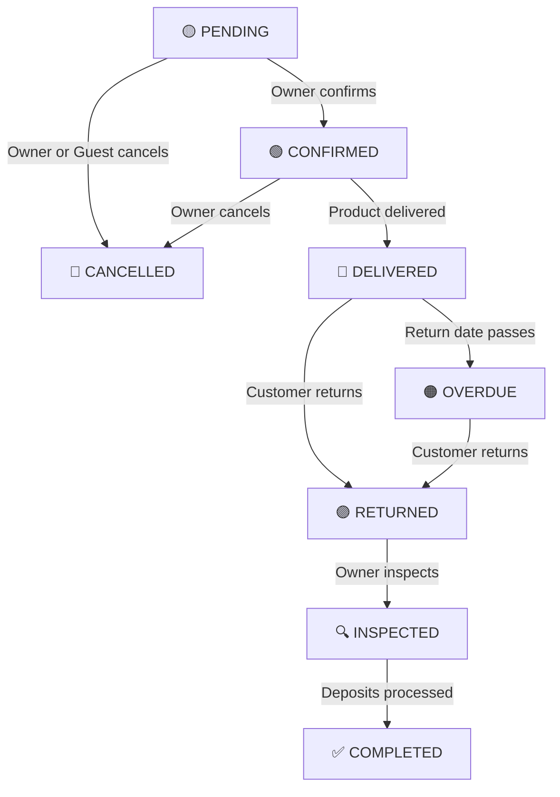

# 📦 Bookings Module — Complete Guide

> **The single source of truth** for understanding every aspect of the Bookings system in the Fashion Rental SaaS platform. Written by reading every line of backend code, frontend API clients, DTOs, database schemas, and documentation.

---

## Table of Contents

1. [What is a Booking?](#1-what-is-a-booking)
2. [Core Concepts](#2-core-concepts)
3. [The Booking Lifecycle — All 8 Stages Explained](#3-the-booking-lifecycle--all-8-stages-explained)
4. [How a Booking Gets Created (Step-by-Step)](#4-how-a-booking-gets-created-step-by-step)
5. [Two Worlds: Guest vs. Owner](#5-two-worlds-guest-vs-owner)
6. [All API Endpoints (Complete Reference)](#6-all-api-endpoints-complete-reference)
7. [Cart Validation — What Happens Before Checkout](#7-cart-validation--what-happens-before-checkout)
8. [Pricing & Money — How Everything is Calculated](#8-pricing--money--how-everything-is-calculated)
9. [Date Blocking — How Availability Works](#9-date-blocking--how-availability-works)
10. [Payments & Deposits](#10-payments--deposits)
11. [Late Fees](#11-late-fees)
12. [Damage Reports](#12-damage-reports)
13. [Cancellation Rules](#13-cancellation-rules)
14. [Manual Booking Power-Ups (Owner Features)](#14-manual-booking-power-ups-owner-features)
15. [Events System](#15-events-system)
16. [Dashboard Stats](#16-dashboard-stats)
17. [Guest Order Tracking](#17-guest-order-tracking)
18. [Database Tables Overview](#18-database-tables-overview)
19. [Scenario Q&A — Real-World Situations](#19-scenario-qa--real-world-situations)
20. [File Map — Where Everything Lives](#20-file-map--where-everything-lives)

---

## 1. What is a Booking?

A **Booking** is the primary transaction in the system. It represents a customer renting **one or more products** for specific date ranges.

| Term | When Used | Context |
|---|---|---|
| **Booking** | Guest side | "I want to book this lehenga" |
| **Order** | Owner side | "I have a new order to process" |

> Both refer to the **same database record** — just at different stages. The guest "books", the owner manages the "order".

### What a Booking Contains

```
Booking (#ORD-2026-0045)
├── Customer Info (name, phone, address)
├── Delivery Details (separate recipient possible)
├── Payment Info (method, status, amount paid)
├── Discount (if any)
├── Internal/Customer Notes
├── Courier Tracking Info
├── Timestamps (created, confirmed, delivered, returned, completed, cancelled)
│
└── Booking Items[] (one or more)
    ├── Item 1: Royal Banarasi Saree (Red, Size M)
    │   ├── Dates: Apr 15 → Apr 17 (3 days)
    │   ├── Base Rental: ৳7,500
    │   ├── Cleaning Fee: ৳500
    │   ├── Deposit: ৳5,000
    │   ├── Backup Size Fee: ৳300
    │   └── Item Total: ৳8,300
    │
    └── Item 2: Silk Lehenga (Blue, Size L)
        ├── Dates: Apr 15 → Apr 18 (4 days)
        ├── Base Rental: ৳12,000
        ├── Extended Days: 1 (৳2,000 extra)
        ├── Deposit: ৳8,000
        └── Item Total: ৳14,000
```

---

## 2. Core Concepts

### Price Snapshots
All prices are **frozen at booking time**. If you change a product's price tomorrow, existing bookings keep their original prices. This prevents disputes.

### Integer Money (ADR-04)
All money values are **integers** (no decimals, no floating point). ৳7,500 is stored as `7500`. This prevents rounding errors.

### Multi-Tenant Isolation
Every query includes `tenantId`. One business owner can never see or modify another's bookings.

### Booking Number Format
`#ORD-{YEAR}-{SEQUENCE}` — e.g., `#ORD-2026-0045`
- Auto-incrementing per tenant per year
- Padded to 4 digits (supports 9,999 orders/year/tenant)
- Generated with `FOR UPDATE` row-level locking to prevent duplicates

### No Account Required
Guests don't need to register or log in. Zero-friction checkout — just name + phone + address.

---

## 3. The Booking Lifecycle — All 8 Stages Explained



### Status Transition Map (from actual code)

```
pending    → [confirmed, cancelled]
confirmed  → [delivered, cancelled]
delivered  → [returned, overdue]
overdue    → [returned]
returned   → [inspected]
inspected  → [completed]
cancelled  → []  (terminal)
completed  → []  (terminal)
```

### What Each Status Means — In Detail

| # | Status | Color | Who Triggers | What It Means | What Happens Internally |
|---|---|---|---|---|---|
| 1 | **PENDING** | 🟡 Yellow | System (auto) | Guest just placed the order. Owner hasn't seen it yet. | Booking created → DateBlocks created as `pending` type → Event `booking.created` emitted |
| 2 | **CONFIRMED** | 🟢 Green | Owner | Owner reviewed and accepted the booking. It's now a real order. | `confirmedAt` timestamp set → DateBlocks upgraded from `pending` → `booking` → Event `booking.confirmed` emitted |
| 3 | **DELIVERED** | 🔵 Blue | Owner | Product has been delivered to the customer. Rental period is now active. | `deliveredAt` timestamp set → Event `booking.delivered` emitted |
| 4 | **OVERDUE** | 🟠 Orange | Owner/System | The rental end date has passed but the product hasn't been returned. | Late fees can be calculated → Event `booking.overdue` emitted |
| 5 | **RETURNED** | 🟣 Purple | Owner | Customer has returned the product. Now waiting for inspection. | `returnedAt` timestamp set → Event `booking.returned` emitted |
| 6 | **INSPECTED** | 🔍 Grey | Owner | Owner has checked the returned product for damage. Damage reports can be filed. | Event `booking.inspected` emitted. Damage reports created if needed. |
| 7 | **COMPLETED** | ✅ Green | Owner | Everything is done — deposits processed, cycle closed. | `completedAt` timestamp set → Product stats updated (totalBookings, totalRevenue) → Customer stats updated (totalSpent) → Event `booking.completed` emitted |
| 8 | **CANCELLED** | 🔴 Red | Owner or Guest | Booking was cancelled before delivery. | `cancelledAt` + `cancellationReason` + `cancelledBy` set → All DateBlocks **deleted** (dates freed) → Event `booking.cancelled` emitted |

### What Happens at Each Transition (Code Actions)

| Transition | Backend Side-Effects |
|---|---|
| → `confirmed` | Sets `confirmedAt`, upgrades DateBlocks `pending` → `booking` |
| → `delivered` | Sets `deliveredAt` |
| → `returned` | Sets `returnedAt` |
| → `completed` | Sets `completedAt`, increments `product.totalBookings` and `product.totalRevenue` for each item, increments `customer.totalSpent` |
| → `cancelled` | Sets `cancelledAt`, `cancelledBy`, `cancellationReason`, **deletes all DateBlocks** |

---

## 4. How a Booking Gets Created (Step-by-Step)

This is the most complex operation in the system. It runs inside a **Serializable transaction** to prevent double-booking.

### The 8 Steps (from [booking.service.ts](file:///d:/Projects%20FINAL/Web%20Development/SaaS/Fashion-Rental-Business-Management-SaaS/apps/backend/src/modules/booking/booking.service.ts))

```
Step 1: Find or Create Customer
  └── By phone number (tenant-scoped dedup)
  └── Outside transaction (idempotent)

Step 2: Validate All Items (INSIDE transaction)
  └── For each cart item:
      ├── Load product + pricing + services + variant
      ├── Check product is published + available
      ├── Validate date range (not in past, start < end)
      ├── Check DateBlock conflicts (any overlap = CONFLICT)
      ├── Calculate pricing via PricingEngine (or fallback)
      └── Apply per-item price override (if manual booking)

Step 3: Generate Booking Number
  └── #ORD-{YEAR}-{NNNN} with FOR UPDATE locking

Step 4: Apply Discount (if provided)
  ├── Flat: subtract fixed amount (capped at grandTotal)
  └── Percentage: % of (subtotal + fees), capped at grandTotal

Step 5: Create the Booking Record
  └── With all delivery, customer, pricing, discount data
  └── Status = 'pending' (or 'confirmed' if autoConfirm)

Step 6: Create BookingItems + DateBlocks
  └── For each validated item:
      ├── BookingItem with all price snapshots
      └── DateBlock with buffer days applied
          └── Type = 'pending' (or 'booking' if autoConfirm)

Step 7: Record Initial Payment (if provided)
  └── Create Payment record
  └── Update booking totalPaid + paymentStatus

Step 8: Emit Events
  └── 'booking.created' always
  └── 'booking.confirmed' if autoConfirm was true
```

### Transaction Isolation

The entire Steps 2-7 run inside a **Serializable** transaction with a 15-second timeout. This means:
- If two people try to book the same product for the same dates at the same time, one will succeed and the other will get a **409 CONFLICT** error
- No phantom reads — the availability check and DateBlock creation are atomic

---

## 5. Two Worlds: Guest vs. Owner

### Guest Side (Public, No Auth)

| Action | Endpoint | What Happens |
|---|---|---|
| Check availability for a month | `GET /products/:id/availability?month=2026-04` | Returns date map: `{ "2026-04-15": "booked", "2026-04-16": "pending" }` |
| Check specific date range | `POST /products/:id/check-availability` | Returns `available: true/false` + pricing breakdown |
| Validate cart before checkout | `POST /bookings/validate` | Validates all items, returns accurate server-side pricing |
| Look up customer by phone | `GET /customers/lookup?phone=01712345678` | Auto-fills checkout if returning customer |
| Place a booking | `POST /bookings` | Atomic booking creation (the big one) |
| Track an order | `GET /bookings/:bookingNumber/status` | Public timeline with courier milestones |

### Owner Side (Authenticated: JWT + Tenant + Roles)

| Action | Endpoint | Required Role |
|---|---|---|
| View dashboard stats | `GET /owner/bookings/stats` | owner, manager, staff |
| List bookings (filterable) | `GET /owner/bookings` | owner, manager, staff |
| View booking detail | `GET /owner/bookings/:id` | owner, manager, staff |
| Confirm booking | `PATCH /owner/bookings/:id/confirm` | owner, manager |
| Mark delivered | `PATCH /owner/bookings/:id/deliver` | owner, manager, staff |
| Mark returned | `PATCH /owner/bookings/:id/return` | owner, manager, staff |
| Mark inspected | `PATCH /owner/bookings/:id/inspect` | owner, manager |
| Mark completed | `PATCH /owner/bookings/:id/complete` | owner, manager |
| Mark overdue | `PATCH /owner/bookings/:id/overdue` | owner, manager |
| Cancel booking | `PATCH /owner/bookings/:id/cancel` | owner, manager |
| Add internal note | `POST /owner/bookings/:id/notes` | owner, manager, staff |
| Report damage | `POST /owner/bookings/:id/items/:itemId/damage` | owner, manager |
| Calculate late fees | `POST /owner/bookings/:id/late-fees` | owner, manager, staff |
| Block dates manually | `POST /owner/products/:id/date-blocks` | owner, manager |
| Remove manual block | `DELETE /owner/date-blocks/:blockId` | owner, manager |

---

## 6. All API Endpoints (Complete Reference)

### Guest Endpoints (No Auth)

```
GET    /api/v1/products/:productId/availability?month=YYYY-MM
POST   /api/v1/products/:productId/check-availability
POST   /api/v1/bookings/validate
POST   /api/v1/bookings
GET    /api/v1/bookings/:bookingNumber/status
GET    /api/v1/customers/lookup?phone=XXXX
```

### Owner Endpoints (JWT Required)

```
GET    /api/v1/owner/bookings/stats
GET    /api/v1/owner/bookings
GET    /api/v1/owner/bookings/:id
PATCH  /api/v1/owner/bookings/:id/status
PATCH  /api/v1/owner/bookings/:id/confirm
PATCH  /api/v1/owner/bookings/:id/deliver
PATCH  /api/v1/owner/bookings/:id/return
PATCH  /api/v1/owner/bookings/:id/inspect
PATCH  /api/v1/owner/bookings/:id/complete
PATCH  /api/v1/owner/bookings/:id/overdue
PATCH  /api/v1/owner/bookings/:id/cancel
POST   /api/v1/owner/bookings/:id/notes
POST   /api/v1/owner/bookings/:id/items/:itemId/damage
POST   /api/v1/owner/bookings/:id/late-fees
POST   /api/v1/owner/products/:productId/date-blocks
DELETE /api/v1/owner/date-blocks/:blockId
```

### Frontend API Client Functions

```typescript
// Guest side (guest-booking.ts)
validateCart(payload)           // POST /bookings/validate
lookupCustomer(phone)          // GET /customers/lookup
createBooking(payload)         // POST /bookings
trackBooking(bookingNumber)    // GET /bookings/:number/status

// Owner side (bookings.ts)
bookingApi.create(payload)         // POST /bookings (also used by manual booking form)
bookingApi.validateCart(payload)    // POST /bookings/validate
bookingApi.checkDateRange(id, s, e) // POST /products/:id/check-availability
bookingApi.getStats()              // GET /owner/bookings/stats
bookingApi.list(query)             // GET /owner/bookings
bookingApi.getById(id)             // GET /owner/bookings/:id
bookingApi.confirm(id)             // PATCH /owner/bookings/:id/confirm
bookingApi.cancel(id, reason)      // PATCH /owner/bookings/:id/cancel
bookingApi.deliver(id)             // PATCH /owner/bookings/:id/deliver
bookingApi.markReturned(id)        // PATCH /owner/bookings/:id/return
bookingApi.inspect(id)             // PATCH /owner/bookings/:id/inspect
bookingApi.complete(id)            // PATCH /owner/bookings/:id/complete
bookingApi.addNote(id, note)       // POST /owner/bookings/:id/notes
bookingApi.reportDamage(id, itemId, payload)  // POST .../damage
bookingApi.recordPayment(id, payload)         // POST .../payments
bookingApi.collectDeposit(itemId)             // PATCH .../deposit/collect
bookingApi.refundDeposit(itemId, payload)     // PATCH .../deposit/refund
bookingApi.forfeitDeposit(itemId, payload)    // PATCH .../deposit/forfeit
bookingApi.uploadDamagePhotos(itemId, files)  // POST /owner/upload/damage-photos
bookingApi.calculateLateFees(id)              // POST .../late-fees
```

---

## 7. Cart Validation — What Happens Before Checkout

Before any booking is created, the cart must be validated. This happens in two layers:

### Layer 1: Pre-Checkout (`POST /bookings/validate`)

Called when the user clicks "Proceed to Checkout" or when cart changes:

1. For each cart item:
   - Load product (check it exists, is published, is available)
   - Load variant (check it exists)
   - Validate dates (not in past, start < end)
   - Check DateBlock conflicts
   - Calculate pricing via PricingEngine
2. Build summary (subtotal, fees, deposits, shipping, grandTotal)
3. Return validation result

**Even if an item is unavailable**, pricing is still calculated so the user sees what it *would* cost.

### Layer 2: At Booking Creation (Inside Transaction)

The **same validation** runs again inside the Serializable transaction. Why? Because between the pre-checkout validation and the actual booking creation, someone else might have booked those dates.

```
Pre-checkout → Shows user prices → User fills in details → Submits
                                                           └── Re-validates everything
                                                               inside transaction
```

### Cart Item Data

Each cart item contains:

| Field | Required | Description |
|---|---|---|
| `productId` | ✅ | Which product |
| `variantId` | ✅ | Which color variant |
| `startDate` | ✅ | Rental start (YYYY-MM-DD) |
| `endDate` | ✅ | Rental end (YYYY-MM-DD) |
| `selectedSize` | ❌ | Selected size label |
| `backupSize` | ❌ | If tenant offers backup sizes |
| `tryOn` | ❌ | If tenant offers try-on service |

---

## 8. Pricing & Money — How Everything is Calculated

### Per-Item Pricing Breakdown

```
baseRental      = Rental price (depends on pricing mode)
extendedCost    = Extra days × extended rate
cleaningFee     = From ProductServices
backupSizeFee   = From ProductServices (if backupSize selected)
tryOnFee        = From ProductServices (if tryOn selected)
depositAmount   = Security deposit from ProductServices
shippingFee     = From ProductPricing (if flat shipping)
─────────────────────────────────────────────────
itemTotal       = baseRental + extendedCost + cleaningFee
                  + backupSizeFee + tryOnFee
```

### Pricing Modes

The pricing engine supports three modes:

| Mode | How Base Rental is Calculated |
|---|---|
| `one_time` | Fixed price for included days + extended rate for extra days |
| `per_day` | Price per day × number of days (minimum days enforced) |
| `percentage` | Percentage of retail price (pre-computed) |

### Booking-Level Summary

```
subtotal     = Sum of (baseRental + extendedCost) across all items
totalFees    = Sum of (cleaningFee + backupSizeFee + tryOnFee) across all items
totalDeposit = Sum of depositAmount across all items
shippingFee  = MAX of shippingFee across all items (one delivery covers all)
─────────────────────────────────────────────────
grandTotal   = subtotal + totalFees + shippingFee + totalDeposit
             - discountAmount (if discount applied)
```

### Pricing Engine Integration

The system first tries the **PricingEngine v2** (deterministic, versioned). If that returns `null` (legacy product), it falls back to the direct calculation from `ProductPricing` and `ProductServices` fields.

---

## 9. Date Blocking — How Availability Works

### Three Types of Date Blocks

| Type | Created When | Meaning |
|---|---|---|
| `pending` | Booking created (status = pending) | Dates are tentatively held |
| `booking` | Booking confirmed | Dates are firmly booked |
| `manual` | Owner manually blocks dates | Maintenance, personal use, etc. |

### Block Lifecycle

```
Guest books → pending block created
Owner confirms → pending block upgraded to booking block
Owner cancels → ALL blocks deleted (dates freed)
```

### Buffer Days

The system supports **buffer days** (configured in StoreSettings). When a DateBlock is created:
- `blockStartDate` = rental start - buffer days
- `blockEndDate` = rental end + buffer days

This prevents back-to-back bookings when you need time for cleaning/inspection.

### Availability Check Response

```json
{
  "productId": "...",
  "month": "2026-04",
  "isAvailable": true,
  "dates": {
    "2026-04-10": "booked",
    "2026-04-11": "booked",
    "2026-04-12": "booked",
    "2026-04-20": "pending",
    "2026-04-25": "blocked"
  }
}
```

Dates **not in the map** are free. This way the calendar only shows occupied dates.

### Conflict Detection

When checking availability for a date range, the system looks for any DateBlock where:
```sql
block.startDate <= requestedEndDate
AND block.endDate >= requestedStartDate
```
This is the standard **overlap detection** formula.

### Double-Booking Prevention

Two mechanisms:
1. **Serializable transaction isolation** — concurrent reads on the same DateBlock rows cause one transaction to retry
2. **GiST EXCLUDE constraint** — database-level constraint that prevents overlapping date ranges per product (defined via raw SQL migration, not Prisma)

---

## 10. Payments & Deposits

### Payment Status (Booking-Level)

| Status | Meaning |
|---|---|
| `unpaid` | No payment has been received |
| `partial` | Some payment received, but less than grandTotal |
| `paid` | Full amount received |

### Payment Methods

`cod` (Cash on Delivery), `bkash`, `nagad`, `sslcommerz`

### Initial Payment at Booking Creation

The manual booking form can record an **initial payment** atomically with booking creation:
```json
{
  "initialPayment": {
    "amount": 5000,
    "method": "bkash",
    "transactionId": "TXN123456",
    "notes": "Advance payment"
  }
}
```
This creates a [Payment](file:///d:/Projects%20FINAL/Web%20Development/SaaS/Fashion-Rental-Business-Management-SaaS/apps/frontend/src/lib/api/bookings.ts#482-506) record and updates `totalPaid` + `paymentStatus` in the same transaction.

### Deposit Lifecycle (Per BookingItem)

| Status | Meaning |
|---|---|
| `pending` | Deposit not yet collected |
| `collected` | Deposit received from customer |
| `held` | Holding during rental period |
| `refunded` | Full deposit returned to customer |
| `partially_refunded` | Partial refund (damage deduction) |
| `forfeited` | Entire deposit kept (severe damage or loss) |

### Deposit API Operations

```
PATCH /owner/booking-items/:itemId/deposit/collect   → Mark as collected
PATCH /owner/booking-items/:itemId/deposit/refund     → Process full/partial refund
PATCH /owner/booking-items/:itemId/deposit/forfeit    → Forfeit entirely
```

---

## 11. Late Fees

### How Late Fees Work

Late fees are calculated **per item** based on the product's pricing configuration.

When `POST /owner/bookings/:id/late-fees` is called:

1. For each booking item:
   - Calculate `lateDays = today - item.endDate`
   - If lateDays ≤ 0 → skip (not late)
2. Apply fee based on product pricing:
   - **Fixed**: `lateFeeAmount × lateDays`
   - **Percentage**: `baseRental × (lateFeePercentage / 100) × lateDays`
3. Cap at `maxLateFee` if configured
4. Update `bookingItem.lateDays` and `bookingItem.lateFee`

### When to Calculate Late Fees

- Manually via the owner dashboard ("Calculate Late Fees" button)
- Before marking a booking as `returned` (to capture final late charges)
- Could be automated via a cron job (not yet implemented)

---

## 12. Damage Reports

### When Can Damage Be Reported?

Only when the booking is in **`returned`** or **`inspected`** status. You can't report damage before the product comes back.

### One Report Per Item

Each [BookingItem](file:///d:/Projects%20FINAL/Web%20Development/SaaS/Fashion-Rental-Business-Management-SaaS/apps/backend/src/modules/booking/dto/booking.dto.ts#155-162) can have exactly one [DamageReport](file:///d:/Projects%20FINAL/Web%20Development/SaaS/Fashion-Rental-Business-Management-SaaS/apps/backend/src/modules/booking/dto/booking.dto.ts#289-315). If you report damage again, it **upserts** (updates the existing report).

### Damage Levels

| Level | Description |
|---|---|
| `none` | No damage found |
| `minor` | Small stains, loose threads |
| `moderate` | Noticeable damage, repairable |
| `severe` | Major damage, expensive to repair |
| `destroyed` | Beyond repair |
| `lost` | Item was not returned |

### Damage Report Fields

| Field | Description |
|---|---|
| `damageLevel` | Severity enum |
| `description` | Free-text damage description |
| `estimatedRepairCost` | How much to fix (optional) |
| `deductionAmount` | Amount deducted from deposit |
| `additionalCharge` | Amount charged beyond the deposit |
| `photos[]` | Array of photo URLs (uploaded to MinIO) |
| `reportedBy` | User ID of who filed the report |

### Damage Photo Upload

Photos are uploaded separately via `POST /owner/upload/damage-photos` (up to 4 files per item). The URLs are then included in the damage report.

---

## 13. Cancellation Rules

### Who Can Cancel What?

| Who | Can Cancel At | Rules |
|---|---|---|
| **Guest** (customer) | `pending` only | Before the owner confirms |
| **Owner** | `pending` or `confirmed` | Must provide a reason |

### What Happens on Cancellation?

1. Booking status → `cancelled`
2. `cancellationReason`, `cancelledBy`, `cancelledAt` are set
3. **All DateBlocks are deleted** — dates immediately become available again
4. Event `booking.cancelled` is emitted

### Cannot Cancel After Delivery

Once a booking reaches `delivered` status, it **cannot be cancelled** through the system. The owner must handle it manually (return → refund).

---

## 14. Manual Booking Power-Ups (Owner Features)

When the owner creates a booking manually (through the owner dashboard), they get extra capabilities:

### Auto-Confirm

```json
{ "autoConfirm": true }
```
Skip the `pending` stage entirely. The booking is created directly as `confirmed`.
- DateBlocks are created as `booking` type (not `pending`)
- Both `booking.created` and `booking.confirmed` events are emitted

### Price Override (Per Item)

```json
{
  "items": [{
    "productId": "...",
    "priceOverride": 5000
  }]
}
```
Override the calculated base rental price for any item. If the override is below the product's `minInternalPrice`, a **warning is logged** but the booking is still allowed (with audit flag).

When a price override is applied:
- `baseRental` = override value
- `extendedDays` = 0
- `extendedCost` = 0
- `itemTotal` is recalculated

### Discount

```json
{
  "discount": {
    "type": "flat",      // or "percentage"
    "value": 1000,       // ৳1,000 flat or 10 = 10%
    "reason": "VIP customer"
  }
}
```
- **Flat**: subtract fixed amount from grandTotal (capped to prevent negative)
- **Percentage**: apply % to (subtotal + totalFees), then cap at grandTotal

### Initial Payment

Record a payment at booking creation time (see [Payments section](#10-payments--deposits)).

### Internal Notes

```json
{ "internalNotes": "Customer is a repeat buyer, give priority" }
```
Visible only to tenant staff, not to the customer.

### Delivery Recipient Override

The customer and delivery recipient can be different people:
```json
{
  "delivery": {
    "deliveryName": "Karim Ahmed",
    "deliveryPhone": "01898765432",
    "deliveryAltPhone": "01798765432"
  }
}
```

---

## 15. Events System

The booking service emits events at every major lifecycle change (following ADR-05):

| Event | When Emitted | Payload |
|---|---|---|
| `booking.created` | New booking placed | tenantId, bookingId, bookingNumber, customerId, grandTotal |
| `booking.confirmed` | Owner confirms | tenantId, bookingId, bookingNumber, customerId |
| `booking.delivered` | Marked as delivered | tenantId, bookingId, bookingNumber, customerId |
| `booking.overdue` | Marked as overdue | tenantId, bookingId, bookingNumber, customerId |
| `booking.returned` | Marked as returned | tenantId, bookingId, bookingNumber, customerId |
| `booking.inspected` | Marked as inspected | tenantId, bookingId, bookingNumber, customerId |
| `booking.completed` | Marked as completed | tenantId, bookingId, bookingNumber, customerId |
| `booking.cancelled` | Cancelled | tenantId, bookingId, bookingNumber, customerId, reason, cancelledBy |
| `booking.damage_reported` | Damage filed | tenantId, bookingId, itemId, damageLevel |

These events can be consumed by:
- **SMS/Notification module** — send alerts to owner/customer
- **Analytics** — track business metrics
- **Future modules** — webhooks, email marketing, etc.

---

## 16. Dashboard Stats

`GET /owner/bookings/stats` returns:

| Stat | Description |
|---|---|
| `pendingCount` | Bookings waiting for confirmation |
| `overdueCount` | Bookings past their return date |
| `todayDeliveries` | Confirmed bookings with items ending today (in transit) |
| `totalActive` | Bookings in pending + confirmed + delivered status |
| `recentBookings` | Last 5 bookings (any status) |
| `revenueThisMonth` | Sum of grandTotal for confirmed+ bookings this month |
| `revenueChart` | Daily revenue for the last 30 days |
| `topProducts` | Top 5 most-booked products |

---

## 17. Guest Order Tracking

`GET /bookings/:bookingNumber/status` returns a rich tracking response:

### Timeline

A unified timeline merging **business stages** and **courier milestones**:

```json
{
  "timeline": [
    { "status": "pending", "label": "Order Placed", "at": "2026-04-13T10:30:00Z", "type": "business" },
    { "status": "confirmed", "label": "Order Confirmed", "at": "2026-04-13T11:00:00Z", "type": "business" },
    { "status": "picked_up", "label": "Picked Up", "at": "2026-04-14T09:00:00Z", "type": "courier" },
    { "status": "in_transit", "label": "In Transit", "at": "2026-04-14T10:30:00Z", "type": "courier" },
    { "status": "delivered", "label": "Delivered", "at": "2026-04-14T14:00:00Z", "type": "business" }
  ]
}
```

### Rental Period Info

```json
{
  "rentalPeriod": {
    "startDate": "2026-04-15",
    "endDate": "2026-04-17",
    "totalDays": 3,
    "daysRemaining": 1,
    "isActive": true,
    "isOverdue": false
  }
}
```

---

## 18. Database Tables Overview

| Table | Purpose |
|---|---|
| `bookings` | The main booking/order record |
| `booking_items` | Individual products within a booking (with price snapshots) |
| `date_blocks` | Which dates are blocked per product (booking / pending / manual) |
| `damage_reports` | Damage assessments for returned items |
| `payments` | Payment records (can have multiple per booking) |
| `customers` | Customer records (deduped by phone per tenant) |

### Key Relationships

```
Booking 1 ← N BookingItem
Booking 1 ← N Payment
Booking 1 ← N DateBlock
BookingItem 1 ← 1 DamageReport (optional)
Booking N → 1 Customer
```

---

## 19. Scenario Q&A — Real-World Situations

### Q: A guest adds a product to cart, then someone else books the same dates before they checkout. What happens?

**A:** The cart validation (pre-checkout) will detect the conflict and show a warning with the conflicting dates. The guest will be prompted to change dates or remove the item. Even if they somehow submit, the booking creation will fail with **409 CONFLICT** because the transaction re-validates inside Serializable isolation.

---

### Q: Two people click "Book Now" for the same product at the exact same time. Who gets it?

**A:** The first transaction to complete gets the dates. The second transaction will detect the DateBlock conflict inside the Serializable transaction and throw a **ConflictException**. The database-level GiST EXCLUDE constraint is the ultimate safety net.

---

### Q: Owner changes the product price after a booking is placed. Does the booking price change?

**A:** **No.** All prices are snapshotted into [BookingItem](file:///d:/Projects%20FINAL/Web%20Development/SaaS/Fashion-Rental-Business-Management-SaaS/apps/backend/src/modules/booking/dto/booking.dto.ts#155-162) at creation time. The booking keeps its original prices forever.

---

### Q: Can a booking have items with different date ranges?

**A:** **Yes.** Each [BookingItem](file:///d:/Projects%20FINAL/Web%20Development/SaaS/Fashion-Rental-Business-Management-SaaS/apps/backend/src/modules/booking/dto/booking.dto.ts#155-162) has its own `startDate` and `endDate`. You can book a saree for Apr 15-17 and a lehenga for Apr 20-22 in the same booking.

---

### Q: What's the difference between `pending` and `booking` date block types?

**A:** `pending` = dates are tentatively held (guest placed order, owner hasn't confirmed yet). `booking` = dates are firmly booked (owner confirmed). When the owner confirms, all `pending` blocks for that booking are upgraded to `booking`. If cancelled, all blocks are deleted.

---

### Q: Can I block dates for a product without creating a booking?

**A:** **Yes.** Use `POST /owner/products/:productId/date-blocks` with a date range and optional reason. This creates a `manual` type block. Only manual blocks can be deleted with `DELETE /owner/date-blocks/:blockId`.

---

### Q: What is "buffer days"?

**A:** Buffer days are extra days added before and after the rental period in the DateBlock. If buffer = 1 and rental is Apr 15-17, the DateBlock will cover Apr 14-18. This gives time for cleaning/inspection between bookings. Configured in StoreSettings.

---

### Q: A customer is late returning a product. What happens?

**A:** The owner marks the booking as `overdue`. Then they can call "Calculate Late Fees" which computes per-item late charges based on the product's pricing configuration (fixed amount per day, or percentage of base rental per day, capped at maxLateFee). The late fees are stored on each BookingItem.

---

### Q: How does damage handling work end-to-end?

**A:**
1. Customer returns the product → Owner marks booking as `returned`
2. Owner inspects the product → marks booking as `inspected`
3. If damage found → Owner creates a damage report for the specific item:
   - Selects damage level (minor → destroyed/lost)
   - Describes the damage
   - Uploads photos (up to 4, stored in MinIO)
   - Sets deduction amount (from deposit)
   - Sets additional charge (if damage exceeds deposit)
4. Owner processes the deposit (refund, partial refund, or forfeit)
5. Owner marks booking as `completed`

---

### Q: Can a guest cancel their own booking?

**A:** Only if the booking is still in `pending` status (before the owner confirms). Once confirmed, only the owner can cancel.

---

### Q: What does auto-confirm do?

**A:** When the owner creates a manual booking with `autoConfirm: true`, the booking skips the `pending` stage and is created directly as `confirmed`. DateBlocks are created as `booking` type (not `pending`). Both `booking.created` and `booking.confirmed` events fire.

---

### Q: How does the owner record payments?

**A:** Via `POST /owner/bookings/:id/payments`. Multiple payments can be recorded per booking. The booking's `paymentStatus` is determined by comparing `totalPaid` against `grandTotal`:
- `totalPaid = 0` → `unpaid`
- `0 < totalPaid < grandTotal` → `partial`
- `totalPaid >= grandTotal` → `paid`

---

### Q: What happens to DateBlocks when a booking is cancelled?

**A:** They are **completely deleted** in a transaction. The dates immediately become available for other bookings.

---

### Q: A customer calls and wants to book by phone. How does the owner handle it?

**A:** The owner uses the **Manual Booking Form** in the owner dashboard. They can:
1. Enter customer details (phone for dedup)
2. Select products and dates
3. Optionally override prices
4. Optionally apply a discount
5. Auto-confirm the booking (skip pending)
6. Record an initial payment
7. Add internal notes

The same `POST /bookings` endpoint is used, but with the extra manual booking power-ups.

---

### Q: What data does the booking detail page show the owner?

**A:** Everything:
- Booking info: number, status, timestamps, payment status
- Customer: name, phone, email, total bookings, total spent, tags
- All items with: product details, dates, full pricing breakdown, deposit status, damage report
- Payment history (all payments with amounts, methods, transaction IDs)
- Delivery address + recipient info
- Courier tracking info
- Discount details
- Internal and customer notes

---

### Q: How are booking numbers generated without conflicts?

**A:** Inside the Serializable transaction, the system uses `FOR UPDATE` row-level locking:
```sql
SELECT booking_number FROM bookings
WHERE tenant_id = $1 AND booking_number LIKE '#ORD-2026-%'
ORDER BY created_at DESC LIMIT 1 FOR UPDATE
```
This prevents two concurrent transactions from reading the same latest number.

---

### Q: What is the [computeSummary](file:///d:/Projects%20FINAL/Web%20Development/SaaS/Fashion-Rental-Business-Management-SaaS/apps/backend/src/modules/booking/booking.service.ts#1489-1502) logic?

**A:**
```
subtotal     = Σ (baseRental + extendedCost)     for all items
totalFees    = Σ (cleaningFee + backupSizeFee + tryOnFee)  for all items
totalDeposit = Σ (depositAmount)                  for all items
shippingFee  = MAX (shippingFee)                  across all items
grandTotal   = subtotal + totalFees + shippingFee + totalDeposit
```

The shipping fee takes the **maximum** across items because one delivery covers all.

---

## 20. File Map — Where Everything Lives

### Backend

| File | Purpose |
|---|---|
| [booking.service.ts](file:///d:/Projects%20FINAL/Web%20Development/SaaS/Fashion-Rental-Business-Management-SaaS/apps/backend/src/modules/booking/booking.service.ts) | All business logic (1572 lines) |
| [booking.controller.ts](file:///d:/Projects%20FINAL/Web%20Development/SaaS/Fashion-Rental-Business-Management-SaaS/apps/backend/src/modules/booking/booking.controller.ts) | 3 controllers: Guest, Owner, DateBlock |
| [booking.dto.ts](file:///d:/Projects%20FINAL/Web%20Development/SaaS/Fashion-Rental-Business-Management-SaaS/apps/backend/src/modules/booking/dto/booking.dto.ts) | All DTOs and validation rules |
| [booking.module.ts](file:///d:/Projects%20FINAL/Web%20Development/SaaS/Fashion-Rental-Business-Management-SaaS/apps/backend/src/modules/booking/booking.module.ts) | Module wiring |

### Frontend

| File | Purpose |
|---|---|
| [bookings.ts](file:///d:/Projects%20FINAL/Web%20Development/SaaS/Fashion-Rental-Business-Management-SaaS/apps/frontend/src/lib/api/bookings.ts) | Owner-side API client + all TypeScript types |
| [guest-booking.ts](file:///d:/Projects%20FINAL/Web%20Development/SaaS/Fashion-Rental-Business-Management-SaaS/apps/frontend/src/lib/api/guest-booking.ts) | Guest-side API client |
| [bookings-table.tsx](file:///d:/Projects%20FINAL/Web%20Development/SaaS/Fashion-Rental-Business-Management-SaaS/apps/frontend/src/app/(owner)/dashboard/bookings/components/bookings-table.tsx) | Owner bookings list table |
| [booking-items.tsx](file:///d:/Projects%20FINAL/Web%20Development/SaaS/Fashion-Rental-Business-Management-SaaS/apps/frontend/src/app/(owner)/dashboard/bookings/[id]/components/booking-items.tsx) | Booking detail items display |
| [manual-booking-form.tsx](file:///d:/Projects%20FINAL/Web%20Development/SaaS/Fashion-Rental-Business-Management-SaaS/apps/frontend/src/app/(owner)/dashboard/bookings/new/components/manual-booking-form.tsx) | Owner manual booking form |
| [booking-calendar.tsx](file:///d:/Projects%20FINAL/Web%20Development/SaaS/Fashion-Rental-Business-Management-SaaS/apps/frontend/src/app/(owner)/dashboard/bookings/calendar/components/booking-calendar.tsx) | Calendar view |
| [recent-bookings.tsx](file:///d:/Projects%20FINAL/Web%20Development/SaaS/Fashion-Rental-Business-Management-SaaS/apps/frontend/src/app/(owner)/dashboard/components/recent-bookings.tsx) | Dashboard recent bookings widget |
| [use-booking-stats.ts](file:///d:/Projects%20FINAL/Web%20Development/SaaS/Fashion-Rental-Business-Management-SaaS/apps/frontend/src/hooks/use-booking-stats.ts) | React hook for dashboard stats |

### Documentation

| File | Purpose |
|---|---|
| [booking-system.md](file:///d:/Projects%20FINAL/Web%20Development/SaaS/Fashion-Rental-Business-Management-SaaS/docs/features/booking-system.md) | Feature specification |
| [guest-booking-flow.md](file:///d:/Projects%20FINAL/Web%20Development/SaaS/Fashion-Rental-Business-Management-SaaS/docs/flows/guest-booking-flow.md) | Guest checkout flow |
| [booking.md (database)](file:///d:/Projects%20FINAL/Web%20Development/SaaS/Fashion-Rental-Business-Management-SaaS/docs/database/booking.md) | Bookings + DateBlocks schema |
| [booking-item.md](file:///d:/Projects%20FINAL/Web%20Development/SaaS/Fashion-Rental-Business-Management-SaaS/docs/database/booking-item.md) | BookingItems + DamageReports schema |
| [booking.md (API)](file:///d:/Projects%20FINAL/Web%20Development/SaaS/Fashion-Rental-Business-Management-SaaS/docs/api/booking.md) | API endpoint design |
| [P07-booking-engine.md](file:///d:/Projects%20FINAL/Web%20Development/SaaS/Fashion-Rental-Business-Management-SaaS/docs/development/P07-booking-engine.md) | Work package for booking engine |
| [P14-owner-bookings-ui.md](file:///d:/Projects%20FINAL/Web%20Development/SaaS/Fashion-Rental-Business-Management-SaaS/docs/development/P14-owner-bookings-ui.md) | Work package for owner UI |

---

> **This guide was generated by reading every line of booking-related code and documentation in the project.** If anything changes in the codebase, update this guide accordingly.
